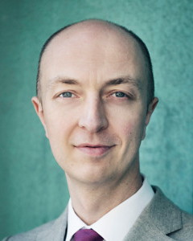

## Organizing Committee

<a href="https://md.ekstrandom.net/">Michael D. Ekstrand</a>

Boise State University

<a href="https://scienceinthenoise.com/">Jean Garcia-Gathright</a>

Spotify

<a href="https://www.colorado.edu/cmci/people/graduate-students/information-science/nasim-sonboli">Nasim Sonboli</a>

University of Colorado Boulder

<a href="https://www.kamishima.net/">Toshihiro Kamishima</a>

National Institute of Advanced Industrial Science and Technology (AIST)

## Steering Committee
{:style="clear: both"}

<a href="http://www.intotheminds.com/blog/en/">Pierre-Nicolas Schwab</a>

Solvay Brussels School of Economics and Management

## Program Committee
{:style="clear: both"}

* Asia J. Biega
* Alex Beutel
* Ludovico Boratto
* Dan Cosley
* Henriette Cramer
* Golnoosh Farnadi
* Benjamin Fields
* Daniel Kluver
* Bart Knijnenburg
* Pigi Kouki
* Preethi Lahoti
* Mirko Marras
* Dimitris Paraschakis
* Piotr Sapiezynski
* Ashudeep Singh
* Ana-Andreea Stoica
* Julia Stoyanovich
* Christo Wilson

